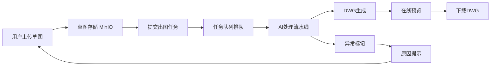

## 1. Product Overview
基于AI识别与规则引导的运营商线路竣工图智能生成系统，实现"草图上传→AI识别→自动出图→规范输出"全流程自动化，大幅提升制图效率和质量一致性。

## 2. Core Features

### 2.1 User Roles
| Role | Registration Method | Core Permissions |
|------|---------------------|------------------|
| 超级管理员 | 系统创建 | 租户管理、全局配置、日志审计 |
| 租户管理员 | 租户创建 | 租户配置、项目管理 |
| 项目管理员 | 邀请加入 | 项目维护、成员管理、权限配置 |
| 制图员 | 邀请加入 | 草图上传、出图提交、DWG下载 |
| 审核员 | 邀请加入 | 图纸预览、审核反馈 |
| 浏览员 | 邀请加入 | 仅查看图纸列表和预览 |

### 2.2 Feature Module
1. **登录页**: 用户身份验证
2. **数据看板**: 核心统计数据、出图趋势、AI识别成功率
3. **项目管理页**: 项目列表、新建/编辑/删除项目
4. **项目详情页**: 项目信息、成员管理、图纸管理、操作日志
5. **图纸管理页**: 目录管理、草图上传、出图提交、文件列表
6. **草图预览页**: 旋转、缩放、全屏预览
7. **DWG在线预览页**: SVG渲染预览、图层图例
8. **任务管理页**: 任务列表、进度查看、异常处理
9. **系统配置页**: 标注规则、图层标准、出图规范、系统参数
10. **租户管理页**: 租户CRUD、启用/停用
11. **操作日志页**: 日志查询、筛选、导出

### 2.3 Page Details
| Page Name | Module Name | Feature description |
|-----------|-------------|---------------------|
| 登录页 | 登录表单 | 用户名/密码输入、显示/隐藏密码、登录失败提示 |
| 数据看板 | 统计卡片 | 项目总数、图纸总数、本月出图量、待处理任务 |
| 数据看板 | 出图趋势图 | 近7/30/90天折线图，支持时间范围切换 |
| 数据看板 | AI识别成功率 | 环形图展示成功/异常比例，支持下钻 |
| 数据看板 | 最近任务列表 | 最新5条任务，状态彩色标签 |
| 数据看板 | 成员出图统计 | Top5柱状图排行 |
| 项目管理页 | 搜索筛选 | 关键词搜索、状态筛选、新建项目 |
| 项目管理页 | 项目列表 | 项目名称、地址、负责人、图纸数、成员数、状态 |
| 项目详情页 | 基本信息 | 名称、地址、负责人、工期、状态切换 |
| 项目详情页 | 成员管理 | 添加/移除成员、角色分配、权限细分 |
| 项目详情页 | 图纸管理 | 目录树、文件列表、上传、出图 |
| 项目详情页 | 操作日志 | 记录所有操作行为 |
| 图纸管理页 | 目录树 | 两级目录结构、新建/重命名/删除 |
| 图纸管理页 | 文件列表 | 列表/网格视图、搜索、状态筛选、批量出图 |
| 图纸管理页 | 草图上传 | 单张上传、格式校验、进度条 |
| 草图预览页 | 工具栏 | 返回、旋转、缩放、全屏 |
| 草图预览页 | 画布 | 居中展示、滚轮缩放、拖拽平移 |
| DWG在线预览页 | 工具栏 | 返回、缩放、全屏、下载 |
| DWG在线预览页 | 画布 | SVG渲染、图层图例浮层 |
| 任务管理页 | 筛选栏 | 项目、状态、时间范围、关键词筛选 |
| 任务管理页 | 任务列表 | 阶段、状态、进度、异常处理 |
| 系统配置页 | 标注规则 | 杆号/路由编号/分纤点格式配置 |
| 系统配置页 | 图层标准 | 5个图层颜色/线型/线宽/字体配置 |
| 系统配置页 | 出图规范 | 图框模板、比例尺、图例样式 |
| 系统配置页 | 系统参数 | 上传大小、超时时间、日志保留天数 |
| 租户管理页 | 租户列表 | 租户信息、状态、新建/编辑/停用/删除 |
| 操作日志页 | 筛选栏 | 操作人、类型、时间、项目、关键词 |
| 操作日志页 | 日志列表 | 时间、操作人、类型、对象、结果、IP |

## 3. Core Process
用户登录 → 进入数据看板 → 选择项目 → 上传草图 → 提交出图任务 → AI自动处理 → 在线预览DWG → 下载图纸

## 4. User Interface Design

### 4.1 Design Style
- **主色调**: 深蓝色 (#1e3a5f)，科技感专业配色
- **辅助色**: 橙色 (#f59e0b) 用于强调和操作按钮
- **成功色**: 绿色 (#10b981)
- **警告色**: 红色 (#ef4444)
- **信息色**: 蓝色 (#3b82f6)
- **按钮风格**: 圆角矩形、渐变背景、hover效果
- **字体**: 中文使用"思源黑体"，英文使用"Inter"
- **布局风格**: 左侧菜单 + 右侧内容区的经典管理后台布局
- **图标**: 使用Lucide图标库

### 4.2 Page Design Overview
| Page Name | Module Name | UI Elements |
|-----------|-------------|-------------|
| 登录页 | 整体布局 | 居中卡片式布局，渐变背景，响应式设计 |
| 数据看板 | 统计卡片 | 白色卡片，圆角，阴影，数字加粗显示 |
| 数据看板 | 图表区域 | 白色背景卡片，图例清晰，交互提示 |
| 项目管理页 | 表格列表 | 斑马纹行，hover高亮，操作按钮对齐 |
| 图纸管理页 | 目录树 | 左侧折叠面板，图标标识，右键菜单 |
| 图纸管理页 | 文件列表 | 列表/网格切换，缩略图预览，状态标签 |
| 任务管理页 | 进度条 | 动态进度动画，阶段文字提示 |
| 系统配置页 | 表单区域 | 分组表单，标签页切换，保存/恢复按钮 |

### 4.3 Responsiveness
- **Desktop-first**: 主设计针对1920×1080分辨率
- **平板适配**: 1024×768，菜单可折叠
- **移动端**: 768px以下，菜单转为抽屉式

### 4.4 3D Scene Guidance
本项目无3D场景需求。