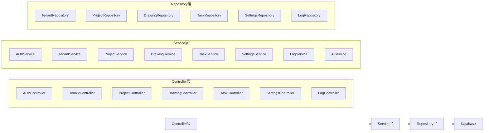
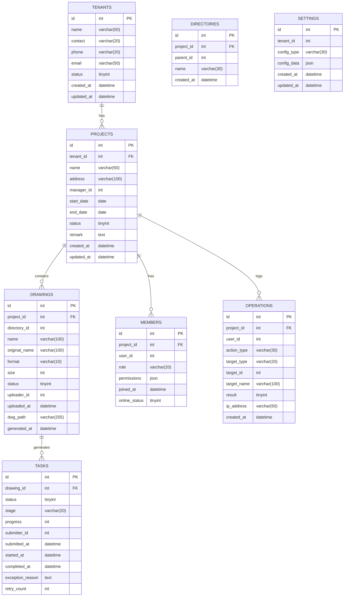

## 1. Architecture Design
```mermaid
flowchart TB
    subgraph Frontend
        A["React@18 + TypeScript"] --> B["TailwindCSS@3"]
        A --> C["React Router DOM"]
        A --> D["Zustand (状态管理)"]
        A --> E["Lucide React (图标)"]
        A --> F["Chart.js (图表)"]
    end
    
    subgraph Backend
        G["Express@4"] --> H["API网关与鉴权"]
        G --> I["任务调度引擎"]
        G --> J["规则引擎"]
        G --> K["文件存储服务"]
    end
    
    subgraph Data
        L["MySQL"]
        M["Redis"]
        N["MinIO"]
    end
    
    subgraph AI Engine
        O["图像预处理"]
        P["AI目标识别"]
        Q["图形矢量化"]
        R["语义标注"]
        S["DWG生成引擎"]
    end
    
    Frontend --> Backend
    Backend --> Data
    Backend --> AI Engine
```

## 2. Technology Description
- **Frontend**: React@18 + TypeScript + TailwindCSS@3 + Vite
- **Initialization Tool**: vite-init
- **Backend**: Express@4 + TypeScript
- **Database**: MySQL (租户数据) + Redis (缓存) + MinIO (文件存储)
- **State Management**: Zustand
- **Routing**: React Router DOM v6
- **Icons**: Lucide React
- **Charts**: Chart.js + react-chartjs-2
- **UI Components**: 自定义组件 + TailwindCSS

## 3. Route Definitions
| Route | Purpose |
|-------|---------|
| /login | 用户登录页 |
| /dashboard | 数据看板首页 |
| /projects | 项目管理页 |
| /projects/:id | 项目详情页 |
| /projects/:id/drawings | 图纸管理页 |
| /projects/:id/drawings/:fileId/preview | 草图预览页 |
| /projects/:id/drawings/:fileId/dwg-preview | DWG在线预览页 |
| /tasks | 任务管理页 |
| /settings | 系统配置页 |
| /tenants | 租户管理页 (仅超级管理员) |
| /logs | 操作日志页 |

## 4. API Definitions

### 4.1 Auth API
| Method | Endpoint | Description |
|--------|----------|-------------|
| POST | /api/auth/login | 用户登录 |
| POST | /api/auth/logout | 用户登出 |
| GET | /api/auth/me | 获取当前用户信息 |

### 4.2 Tenant API
| Method | Endpoint | Description |
|--------|----------|-------------|
| GET | /api/tenants | 获取租户列表 |
| POST | /api/tenants | 创建租户 |
| GET | /api/tenants/:id | 获取租户详情 |
| PUT | /api/tenants/:id | 更新租户 |
| DELETE | /api/tenants/:id | 删除租户 |

### 4.3 Project API
| Method | Endpoint | Description |
|--------|----------|-------------|
| GET | /api/projects | 获取项目列表 |
| POST | /api/projects | 创建项目 |
| GET | /api/projects/:id | 获取项目详情 |
| PUT | /api/projects/:id | 更新项目 |
| DELETE | /api/projects/:id | 删除项目 |

### 4.4 Drawing API
| Method | Endpoint | Description |
|--------|----------|-------------|
| GET | /api/projects/:id/drawings | 获取图纸列表 |
| POST | /api/projects/:id/drawings/upload | 上传草图 |
| GET | /api/projects/:id/drawings/:fileId | 获取图纸详情 |
| PUT | /api/projects/:id/drawings/:fileId/rename | 重命名图纸 |
| DELETE | /api/projects/:id/drawings/:fileId | 删除图纸 |
| POST | /api/projects/:id/drawings/export | 批量出图 |

### 4.5 Task API
| Method | Endpoint | Description |
|--------|----------|-------------|
| GET | /api/tasks | 获取任务列表 |
| GET | /api/tasks/:id | 获取任务详情 |
| POST | /api/tasks/:id/resubmit | 重新提交异常任务 |

### 4.6 Settings API
| Method | Endpoint | Description |
|--------|----------|-------------|
| GET | /api/settings/annotation | 获取标注规则配置 |
| PUT | /api/settings/annotation | 更新标注规则配置 |
| GET | /api/settings/layers | 获取图层标准配置 |
| PUT | /api/settings/layers | 更新图层标准配置 |
| GET | /api/settings/export | 获取出图规范配置 |
| PUT | /api/settings/export | 更新出图规范配置 |
| GET | /api/settings/system | 获取系统参数配置 |
| PUT | /api/settings/system | 更新系统参数配置 |

### 4.7 Logs API
| Method | Endpoint | Description |
|--------|----------|-------------|
| GET | /api/logs | 获取操作日志列表 |
| POST | /api/logs/export | 导出操作日志 |

## 5. Server Architecture Diagram


## 6. Data Model

### 6.1 Data Model Definition


### 6.2 Data Definition Language

#### tenants表
```sql
CREATE TABLE tenants (
    id BIGINT AUTO_INCREMENT PRIMARY KEY,
    name VARCHAR(50) NOT NULL,
    contact VARCHAR(20),
    phone VARCHAR(20),
    email VARCHAR(50),
    status TINYINT DEFAULT 1 COMMENT '1:启用 0:停用',
    created_at DATETIME DEFAULT CURRENT_TIMESTAMP,
    updated_at DATETIME DEFAULT CURRENT_TIMESTAMP ON UPDATE CURRENT_TIMESTAMP,
    UNIQUE KEY uk_name (name)
) ENGINE=InnoDB DEFAULT CHARSET=utf8mb4;
```

#### projects表
```sql
CREATE TABLE projects (
    id BIGINT AUTO_INCREMENT PRIMARY KEY,
    tenant_id BIGINT NOT NULL,
    name VARCHAR(50) NOT NULL,
    address VARCHAR(100),
    manager_id BIGINT,
    start_date DATE,
    end_date DATE,
    status TINYINT DEFAULT 1 COMMENT '1:进行中 2:已完成 3:已归档 4:已作废',
    remark TEXT,
    created_at DATETIME DEFAULT CURRENT_TIMESTAMP,
    updated_at DATETIME DEFAULT CURRENT_TIMESTAMP ON UPDATE CURRENT_TIMESTAMP,
    UNIQUE KEY uk_tenant_name (tenant_id, name),
    KEY idx_tenant_id (tenant_id)
) ENGINE=InnoDB DEFAULT CHARSET=utf8mb4;
```

#### members表
```sql
CREATE TABLE members (
    id BIGINT AUTO_INCREMENT PRIMARY KEY,
    project_id BIGINT NOT NULL,
    user_id BIGINT NOT NULL,
    role VARCHAR(20) NOT NULL COMMENT 'project_admin/cartographer/auditor/browser',
    permissions JSON,
    joined_at DATETIME DEFAULT CURRENT_TIMESTAMP,
    online_status TINYINT DEFAULT 0 COMMENT '0:离线 1:在线',
    UNIQUE KEY uk_project_user (project_id, user_id),
    KEY idx_project_id (project_id)
) ENGINE=InnoDB DEFAULT CHARSET=utf8mb4;
```

#### directories表
```sql
CREATE TABLE directories (
    id BIGINT AUTO_INCREMENT PRIMARY KEY,
    project_id BIGINT NOT NULL,
    parent_id BIGINT DEFAULT 0,
    name VARCHAR(30) NOT NULL,
    created_at DATETIME DEFAULT CURRENT_TIMESTAMP,
    UNIQUE KEY uk_project_parent_name (project_id, parent_id, name),
    KEY idx_project_id (project_id)
) ENGINE=InnoDB DEFAULT CHARSET=utf8mb4;
```

#### drawings表
```sql
CREATE TABLE drawings (
    id BIGINT AUTO_INCREMENT PRIMARY KEY,
    project_id BIGINT NOT NULL,
    directory_id BIGINT DEFAULT 0,
    name VARCHAR(100) NOT NULL,
    original_name VARCHAR(100),
    format VARCHAR(10),
    size INT,
    status TINYINT DEFAULT 1 COMMENT '1:未出图 2:处理中 3:已完成 4:异常',
    uploader_id BIGINT,
    uploaded_at DATETIME DEFAULT CURRENT_TIMESTAMP,
    dwg_path VARCHAR(255),
    generated_at DATETIME,
    KEY idx_project_id (project_id),
    KEY idx_directory_id (directory_id),
    KEY idx_status (status)
) ENGINE=InnoDB DEFAULT CHARSET=utf8mb4;
```

#### tasks表
```sql
CREATE TABLE tasks (
    id BIGINT AUTO_INCREMENT PRIMARY KEY,
    drawing_id BIGINT NOT NULL,
    status TINYINT DEFAULT 1 COMMENT '1:待处理 2:处理中 3:已完成 4:异常',
    stage VARCHAR(20) COMMENT '预处理中/AI识别中/矢量化中/标注中/DWG生成中',
    progress INT DEFAULT 0,
    submitter_id BIGINT,
    submitted_at DATETIME DEFAULT CURRENT_TIMESTAMP,
    started_at DATETIME,
    completed_at DATETIME,
    exception_reason TEXT,
    retry_count INT DEFAULT 0,
    KEY idx_drawing_id (drawing_id),
    KEY idx_status (status),
    KEY idx_submitted_at (submitted_at)
) ENGINE=InnoDB DEFAULT CHARSET=utf8mb4;
```

#### operations表
```sql
CREATE TABLE operations (
    id BIGINT AUTO_INCREMENT PRIMARY KEY,
    project_id BIGINT,
    user_id BIGINT NOT NULL,
    action_type VARCHAR(30) NOT NULL,
    target_type VARCHAR(20),
    target_id BIGINT,
    target_name VARCHAR(100),
    result TINYINT DEFAULT 1 COMMENT '1:成功 0:失败',
    ip_address VARCHAR(50),
    created_at DATETIME DEFAULT CURRENT_TIMESTAMP,
    KEY idx_project_id (project_id),
    KEY idx_user_id (user_id),
    KEY idx_action_type (action_type),
    KEY idx_created_at (created_at)
) ENGINE=InnoDB DEFAULT CHARSET=utf8mb4;
```

#### settings表
```sql
CREATE TABLE settings (
    id BIGINT AUTO_INCREMENT PRIMARY KEY,
    tenant_id BIGINT,
    config_type VARCHAR(30) NOT NULL COMMENT 'annotation/layers/export/system',
    config_data JSON,
    created_at DATETIME DEFAULT CURRENT_TIMESTAMP,
    updated_at DATETIME DEFAULT CURRENT_TIMESTAMP ON UPDATE CURRENT_TIMESTAMP,
    UNIQUE KEY uk_tenant_type (tenant_id, config_type),
    KEY idx_tenant_id (tenant_id)
) ENGINE=InnoDB DEFAULT CHARSET=utf8mb4;
```

## 7. Project Structure
```
src/
├── components/
│   ├── layout/
│   │   ├── Sidebar.tsx
│   │   ├── Header.tsx
│   │   └── Layout.tsx
│   ├── common/
│   │   ├── Button.tsx
│   │   ├── Input.tsx
│   │   ├── Table.tsx
│   │   ├── Modal.tsx
│   │   ├── Tag.tsx
│   │   └── Progress.tsx
│   ├── dashboard/
│   │   ├── StatCard.tsx
│   │   ├── TrendChart.tsx
│   │   ├── SuccessRateChart.tsx
│   │   ├── RecentTasks.tsx
│   │   └── MemberStats.tsx
│   ├── project/
│   │   ├── ProjectList.tsx
│   │   ├── ProjectForm.tsx
│   │   └── MemberManagement.tsx
│   ├── drawing/
│   │   ├── DirectoryTree.tsx
│   │   ├── FileList.tsx
│   │   ├── FileUploader.tsx
│   │   └── PreviewCanvas.tsx
│   ├── task/
│   │   ├── TaskList.tsx
│   │   └── TaskProgress.tsx
│   └── settings/
│       ├── AnnotationSettings.tsx
│       ├── LayerSettings.tsx
│       ├── ExportSettings.tsx
│       └── SystemSettings.tsx
├── pages/
│   ├── Login.tsx
│   ├── Dashboard.tsx
│   ├── Projects.tsx
│   ├── ProjectDetail.tsx
│   ├── Drawings.tsx
│   ├── SketchPreview.tsx
│   ├── DwgPreview.tsx
│   ├── Tasks.tsx
│   ├── Settings.tsx
│   ├── Tenants.tsx
│   └── Logs.tsx
├── hooks/
│   ├── useAuth.ts
│   ├── useProjects.ts
│   ├── useDrawings.ts
│   ├── useTasks.ts
│   └── useSettings.ts
├── store/
│   └── useStore.ts
├── utils/
│   ├── api.ts
│   ├── constants.ts
│   └── helpers.ts
├── types/
│   └── index.ts
├── App.tsx
├── main.tsx
└── index.css
```